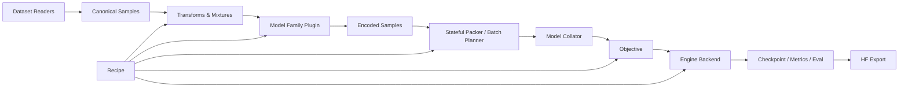

# TrainOmni Architecture v0.1

- 状态：Superseded by [Framework Blueprint v1](framework-blueprint-v1.md)
- 日期：2026-08-19
- 决策目标：先稳定难以迁移的数据/模型/恢复边界，再实现训练循环

> 本文保留早期接口草案和决策演化记录。2026-08-20 起，以 v1 blueprint、完整训练生命周期和开源底座 ADR 为当前架构依据；目标 checkpoint 只作为未来模型插件验收样例。

## 1. 总体架构



核心包建议：

```text
trainomni/
  data/          canonical schema, readers, transforms, mixtures, packing
  models/        plugin protocol, registry, family implementations
  objectives/    cpt/sft, preference, distillation, rollout contracts
  recipes/       typed configuration and stage composition
  engines/       local/ddp/fsdp2, optional trl/nemo/verl backends
  checkpoint/    run state, DCP, consolidated export
  eval/          generation and metric plugins
  cli/           validate, inspect, train, resume, export
```

## 2. 稳定接口

### 2.1 Model Family Plugin

一个模型家族插件聚合相关实现，但对外只有窄接口。插件内部可以有 formatter、processor adapter 和 collator 子类，避免把所有逻辑塞进一个 `Template`。

```python
class ModelFamilyPlugin(Protocol):
    plugin_id: str
    plugin_version: str

    def capabilities(self) -> ModelCapabilities: ...

    def build(self, config: ModelConfig) -> ModelBundle: ...

    def component_catalog(self, bundle: ModelBundle) -> ComponentCatalog: ...

    def validate_sample(
        self, sample: CanonicalSample, objective: ObjectiveSpec
    ) -> list[ValidationIssue]: ...

    def encode(
        self, sample: CanonicalSample, context: EncodeContext
    ) -> EncodedSample: ...

    def collate(
        self, samples: list[EncodedSample], plan: BatchPlan
    ) -> ModelBatch: ...

    def export(
        self, bundle: ModelBundle, checkpoint: CheckpointRef, target: ExportTarget
    ) -> ExportManifest: ...
```

`ModelBundle` 包含 model、processor/tokenizer、generation defaults、state-dict adapter 和可选 teacher/reference model，不暴露 engine-specific wrapper。

`ComponentCatalog` 必须稳定标识：

- `vision_encoder`
- `vision_merger`（可选）
- `connector`
- `language_model`
- `other`（必须显式审计，默认不训练）

插件注册时必须测试所有参数恰好属于一个 component。训练策略按 component ID 应用，不依赖容易变化的字符串前缀。

### 2.2 Capabilities

```python
@dataclass(frozen=True)
class ModelCapabilities:
    modalities: frozenset[str]
    content_blocks: frozenset[str]
    objectives: frozenset[str]
    max_media_per_sample: int | None
    supports_packing: bool
    supports_padding_free: bool
    supports_generation: bool
    supported_attention: frozenset[str]
    supported_parallelism: frozenset[str]
```

Engine 也声明 capability。启动前执行：

```text
recipe requirements
  ∩ model capabilities
  ∩ objective capabilities
  ∩ engine capabilities
  ∩ hardware capabilities
```

任何空交集或非法组合在加载全量权重前失败。

### 2.3 Objective

```python
class Objective(Protocol):
    objective_id: str

    def required_sample_fields(self) -> RequirementSet: ...
    def prepare_batch(self, batch: ModelBatch) -> ObjectiveBatch: ...
    def compute_loss(self, model: nn.Module, batch: ObjectiveBatch) -> LossOutput: ...
    def metrics(self, output: LossOutput) -> Mapping[str, Scalar]: ...
```

边界原则：

- CPT/SFT 可以共享 masked next-token objective，但默认 loss policy 不同。
- preference objective 负责 chosen/rejected/reference 逻辑，不负责 FSDP 包装。
- rollout objective 只定义 prompt、generation request、reward 和 update 所需数据；实际 rollout 交给 backend。
- loss 返回命名分量和 denominator，不能只返回一个 scalar，便于混合 objective 和审计。

### 2.4 Engine Backend

```python
class EngineBackend(Protocol):
    backend_id: str

    def capabilities(self) -> EngineCapabilities: ...
    def prepare(self, run: RunContext) -> PreparedRun: ...
    def train(self, run: PreparedRun) -> TrainResult: ...
    def evaluate(self, run: PreparedRun, suite: EvalSuite) -> EvalResult: ...
    def save(self, run: PreparedRun, reason: str) -> CheckpointRef: ...
    def resume(self, checkpoint: CheckpointRef, mode: ResumeMode) -> PreparedRun: ...
```

建议后端路线：

| 后端 | 优先级 | 职责 |
|---|---|---|
| `torch` | P0 | 单卡/DDP 基础循环、最少依赖、调试 oracle |
| `fsdp2` | P0 | 默认多卡 full-shard 与 DCP checkpoint |
| `trl` | P1 | DPO/KTO/GRPO/Distillation 等算法集成 |
| `nemo` | P1 | TP/PP/CP、FP8、规模化 VLM 和 topology-aware checkpoint |
| `deepspeed` | P1 | 与现有集群/ZeRO recipe 兼容 |
| `verl` | P2 | 大规模在线 RL/rollout orchestration |
| `megatron` | P2 | 超大 dense/MoE 的 3D/4D parallelism |

### 2.5 Stateful data component

所有影响样本顺序或内容的运行时对象实现：

```python
class Stateful(Protocol):
    state_version: str
    def state_dict(self) -> dict[str, Any]: ...
    def load_state_dict(self, state: Mapping[str, Any]) -> None: ...
```

至少包括 reader/shard cursor、mixture sampler、batch sampler、packer、transform RNG 和 dataloader。State 中保存 ID/cursor/RNG，不保存大型 decoded media tensor。

## 3. Recipe 配置模型

Recipe 是声明式 run spec，不是任意 Python 对象图。配置使用带版本号的 typed dataclass/Pydantic model，从 YAML 加载；未知字段默认报错。

示例：

```yaml
schema_version: trainomni.recipe.v0.1
name: qwen35_vit_minicpm5_l0_align
seed: 20260819

model:
  plugin: composite_vlm
  vision:
    path: D:/Models/VLM/Qwen3.5-0.8B
  language:
    path: D:/Models/LLM/MiniCPM5-1B
  connector:
    type: mlp2x_gelu

stage:
  objective: sft
  max_steps: 1000

component_policy:
  vision_encoder: {trainable: false}
  vision_merger: {trainable: false}
  connector: {trainable: true, lr: 1.0e-3}
  language_model: {trainable: false}

data:
  mixtures:
    - {dataset: caption_alignment, weight: 0.7}
    - {dataset: ocr_alignment, weight: 0.3}
  max_text_tokens: 2048
  max_pixels: 1000000

engine:
  backend: fsdp2
  precision: bf16
  gradient_accumulation_steps: 8

checkpoint:
  every_steps: 100
  exact_resume: true
  export_hf: true
```

上例只表达接口形状，不代表最终 L0 方案；checkpoint 路径和冻结策略需要 Research/Downloader 最终确认。

## 4. Model plugin 内部分层

```text
ModelFactory
  loads/assembles modules and state-dict mappings

ContentFormatter
  typed blocks -> model-specific conversation/grounding/tool representation

ProcessorAdapter
  formatted content + decoded media -> tensors and source span mapping

LossMaskBuilder
  source span + objective policy -> labels/token weights

CostEstimator
  text/media metadata -> token/pixel/frame/compute estimate

BatchCollator
  encoded samples + pack plan -> exact model forward kwargs

CheckpointAdapter
  training state dict <-> HF-compatible export
```

这样接入新模型时不需要修改 dataset reader、mixture、objective 或 engine。模型只有特殊 collator 时，只替换该子组件。

## 5. 数据预算与 packing

VLM batch 不能只使用文本长度。统一 cost model：

```text
cost = text_tokens
     + vision_token_estimate
     + video_frame_cost
     + model_specific_overhead
```

Batch Planner 接受多个硬限制：

- `max_text_tokens`
- `max_visual_tokens` 或 `max_pixels`
- `max_frames`
- `max_total_cost`
- `max_samples`

P0 可以先做 cost-aware bucketing + padding；P1 packing 要求：

- pack 内每个 sample 有 segment ID；
- causal attention 与 vision cross-attention 均隔离；
- position IDs 按模型规则重置或连续；
- labels/token weights 与 source span 保持一致；
- pack plan 可保存和恢复；
- encoder/collator 能输出 sample-to-token trace。

## 6. Checkpoint 模型

```text
checkpoint_<global_step>/
  manifest.json
  model/                 sharded DCP or adapter state
  optimizer/
  scheduler/
  rng/
  data/
    dataloader_rank_*.pt
    mixer_rank_*.pt
    packer_rank_*.pt
  recipe/
    source.yaml
    resolved.yaml
  provenance/
    datasets.json
    environment.json
    code.json
  export/                optional HF-compatible snapshot
```

`manifest.json` 记录 component versions、world topology、checkpoint completeness marker 和 lineage。保存流程先写 incomplete marker，所有 rank 完成后原子发布；恢复默认跳过 incomplete checkpoint。

两种恢复模式：

- `exact`：恢复全部状态并验证 fingerprint；不满足则失败。
- `weights_only`：只加载模型/adapter 权重，创建新的 run lineage；必须显式请求。

## 7. Evaluation 与 trace

框架首先提供 inspectability：

```text
trainomni validate recipe.yaml
trainomni inspect-data recipe.yaml --samples 8
trainomni inspect-model recipe.yaml
trainomni dry-run recipe.yaml
trainomni train recipe.yaml
trainomni resume checkpoint_dir --mode exact
trainomni export checkpoint_dir --format hf
```

`inspect-data` 应展示：

- canonical blocks 和 resolved assets；
- formatter 生成的模型文本/特殊 token；
- token IDs 对应的 source span、labels/loss weights；
- media tensor shapes、视觉 token estimate；
- truncation、drop、crop、resize 和 pack 决策。

这是 VLM 训练框架的 P0 能力，因为多数 silent bug 出现在模板、media 顺序、坐标缩放和 loss mask，而不是 optimizer。

## 8. 对目标 Qwen3.5 ViT + MiniCPM5-1B 的适配计划

先实现 `composite_vlm` 通用插件，再用目标 family profile 提供差异：

1. 加载 vision tower/merger 与 MiniCPM LLM，不做训练，验证 dtype、hidden size、tokenizer 和 forward signature。
2. 显式定义 connector input/output shape、视觉 token 数和插入位置。
3. 完成 image + text forward，确认 position IDs、attention mask、labels 和 cache 行为。
4. 注册 component catalog，验证 L0 只更新 connector。
5. 做 synthetic image 的 2-step overfit；随后接小规模真实 caption/OCR 数据。
6. 再决定是否复用 Qwen processor、独立 image processor，或实现组合 processor。

模型 profile 不应覆盖 canonical data 或 engine，只提供 factory/formatter/processor/collator/state-dict mapping。

## 9. 关键决策记录

### ADR-001：自有 canonical data contract

- 决定：采用 typed content block + asset reference。
- 原因：避免 `<image>`/bbox token 与并列数组造成的顺序耦合；同一数据可投影到 ms-swift、TRL、NeMo 或自有 engine。
- 代价：需要维护 importer 与 semantic validator。

### ADR-002：不 fork ms-swift

- 决定：ms-swift 作为 capability oracle/cross-check，不作为核心依赖。
- 原因：覆盖全面但模型、模板、编码、collator 和一站式运行时耦合较深。
- 复审条件：若 v0.1 时间约束要求立即用其完成一次基线训练，可实现临时 `ms_swift_exporter`，不改变核心协议。

### ADR-003：FSDP2 是默认规模化路径

- 决定：P0 为 torch/DDP/FSDP2，NeMo/DeepSpeed 后置。
- 原因：目标模型规模小，PyTorch-native 路径依赖少；DCP 可支持长期 checkpoint 设计。
- 复审条件：目标硬件/集群只支持既有 DeepSpeed/NeMo launcher。

### ADR-004：Exact resume 是协议要求

- 决定：所有 stateful data component 从第一版实现 state API。
- 原因：mixture、streaming 和 packing 会让只保存 optimizer 的恢复不可复现。
- 代价：首版数据代码更严格，但避免后期破坏接口。

## 10. 里程碑

| 里程碑 | 交付 | 完成定义 |
|---|---|---|
| M0 Contract | schema、typed models、validator、fixtures | 正/反例测试与 sample hash 稳定 |
| M1 Core smoke | readers、plugin protocol、torch engine、masked SFT | 公开 tiny VLM 2-step train/save/load |
| M2 Target L0 | composite plugin、connector、component policy | 目标模型 dry-run + connector-only overfit |
| M3 Reliable train | FSDP2、stateful data、DCP、HF export | exact-resume 等价测试通过 |
| M4 Post-training | preference adapter + TRL backend | multimodal DPO smoke 和 export |
| M5 Online RL | rollout/reward interface + veRL/TRL backend | VLM RLVR 小规模端到端验证 |

当前下一步是 M0，而不是立即实现完整 Trainer。
