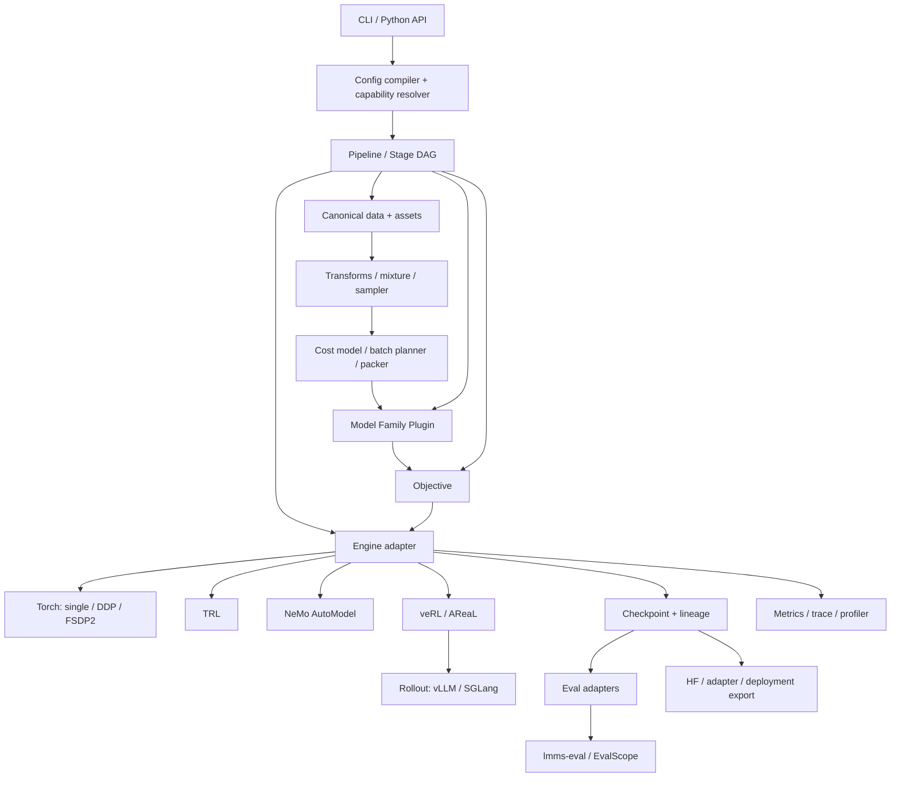

# TrainOmni Framework Blueprint v1

> 实现状态：该蓝图已经落地为 Framework v1。当前能力边界和验证证据分别见 [support matrix](support-matrix-v1.md)、[implementation report](../implementation/framework-v1-2026-08.md) 和 [verification report](../verification/verification-2026-08-20.md)。文末 M1–M6 保留为演进路线，不是当前未完成清单。

- 状态：Accepted architecture target
- 日期：2026-08-20
- 目标：一个模型中立、数据自由、后端可替换、可恢复和可验证的完整 VLM 训练框架
- 非目标：复刻另一个大一统模型微调产品，或为单一目标模型定制训练脚本

## 1. 架构原则

1. **原始语义由 canonical contract 持有。** 模型 token、processor tensor 和 Trainer 列格式都是派生表示。
2. **新模型通过插件加入。** 正常接入不修改 core、reader、objective、engine 或 CLI。
3. **阶段意图与执行实现分离。** Objective/Stage 描述训练什么，Engine 描述怎样执行。
4. **配置是可验证的声明，不是任意 Python 对象图。** 用户配置经编译后产生不可变 resolved recipe。
5. **精确恢复是协议属性。** reader、mixture、transform、packer、optimizer 和 RNG 从第一版就可保存状态。
6. **先可检查，再开大训练。** validate/inspect/dry-run 在加载全量权重和申请大集群前发现静默错误。
7. **外部框架在适配器后面。** TRL/NeMo/veRL 的数据类和配置不泄漏进公共 API。
8. **能力显式协商，不静默 fallback。** model/objective/engine/hardware 不兼容就早失败。
9. **所有产物可追溯。** checkpoint、processor、recipe、数据和评测通过 lineage 关联。
10. **接口面覆盖完整生命周期，具体实现分里程碑交付。** 不用“首版没做 RL”为理由破坏未来扩展。

## 2. 总体结构



### 控制面与数据面

- 控制面：config compiler、registry、capability resolver、pipeline、stage、artifact、launcher、CLI。
- 数据面：reader、canonical sample、asset resolver、transform、mixture、encoder、packer、collator。
- 执行面：objective、engine、rollout、reward、checkpoint、eval。

控制面是最稳定的核心；执行面允许快速跟进生态；模型特有逻辑集中在插件。

## 3. 建议包结构

```text
trainomni/
  contracts/       schema versions, capabilities, issues, artifact refs
  config/          user config, compiler, resolved config, migrations
  registry/        entry-point discovery and plugin manifests
  data/
    canonical/     sample and asset contracts
    readers/       jsonl, parquet, hf, webdataset, custom
    transforms/    deterministic semantic/media transforms
    mixtures/      manifests, sampling, curriculum
    batching/      cost, sampler, planner, packing
    trace/         sample lineage and inspect views
  models/
    protocol/      Model Family Plugin interfaces
    components/    component policies and parameter audit
    export/        checkpoint/state-dict conversion contracts
  objectives/      causal LM, KD, preference, reward, rollout specs
  recipes/         stage templates and pipeline DAG
  engines/
    torch/         single, DDP, FSDP2, DCP
    trl/           algorithm adapters
    nemo/          scale backend adapter
    verl/          online RL adapter
    areal/         async agentic adapter
  rollout/         provider and environment protocols
  checkpoint/      state registry, manifest, retention, resume
  eval/            in-loop metrics and external suite adapters
  observability/   logs, metrics, profiler, health events
  launch/          local, torchrun, Slurm and container specs
  cli/             validate, inspect, dry-run, train, resume, export
```

目录不是必须一次全部创建；只有得到测试和真实用例的模块才进入实现树。

## 4. 配置系统

### 4.1 两阶段配置

用户配置允许引用默认值、插件和 artifact；编译后生成 `ResolvedRunSpec`：

```text
user YAML
  -> schema validation
  -> includes/defaults resolved
  -> plugin discovery
  -> artifact/model/data resolution
  -> capability negotiation
  -> topology and budget validation
  -> immutable resolved YAML/JSON + fingerprint
```

原则：

- schema 有明确版本和 migration；
- 未知字段报错；
- 不执行配置内任意 Python；
- 路径、Hub revision、plugin version、backend version 均解析为精确值；
- secret 只保存引用或脱敏值；
- backend-specific 参数位于 `engine.config` 的命名空间中，不污染通用字段。

### 4.2 PipelineSpec 与 StageSpec

`PipelineSpec` 是 DAG，支持：

- 顺序阶段；
- teacher/reference/reward 分支；
- checkpoint selector（last/best/approved）；
- metric/manual gate；
- stage retry 与 resume policy；
- artifact cache 与已有阶段复用。

`StageSpec` 的完整字段见 [VLM 完整训练生命周期](vlm-training-lifecycle-v1.md)。

## 5. 数据系统

### 5.1 Canonical sample

公共样本由 typed content blocks 和 asset references 构成，覆盖：

- objective：`cpt`、`sft`、`preference`、`prompt_only`，后续扩展 reward/episode；
- role：system/user/assistant/tool；
- block：text、image、video、audio、bbox、point、json、tool call/result；
- asset：URI/path、mime、checksum、size/shape、source/license；
- supervision：message/span/token 权重、chosen/rejected/score、metadata；
- provenance：dataset/sample/revision/transform lineage。

Canonical contract 不保存：

- `<image>`、`<box>` 等模型 token；
- `input_ids`、`pixel_values`；
- 某个 Trainer 的 `prompt/chosen/rejected` 列布局；
- 未注明坐标系的 bbox；
- 只靠数组顺序关联 media 的隐式关系。

### 5.2 Reader 与 importer

Reader 负责物理 IO，Importer 负责外部语义映射。二者分开：同一 JSONL reader 可以承载 ShareGPT、LLaVA、自定义 annotation 等 importer。

每个 importer 输出：

- canonical sample；
- source trace；
- validation issue；
- 映射版本。

坏样本策略明确为 fail/quarantine/drop-with-budget，drop 必须计数并可追踪。

### 5.3 Formatter、encoder、packer、collator

```text
CanonicalSample
  -> semantic transform
  -> model ContentFormatter
  -> model ProcessorAdapter / LossMaskBuilder
  -> EncodedSample + source spans + cost
  -> framework BatchPlanner / StatefulPacker
  -> model BatchCollator
  -> ModelBatch
```

边界：

- formatter/processor/collator 属于 model plugin；
- mixture/batch plan/pack state 属于 framework；
- pack plan 描述样本顺序、segment、预算和隔离要求；
- collator 将 plan 转为该模型的 position IDs、attention mask、media grid 等 forward kwargs。

### 5.4 Cost 与 batching

统一 cost vector 而非单一 sequence length：

```text
text_tokens
vision_tokens_estimate
pixels / tiles
video_frames
audio_seconds / tokens
model_overhead
estimated_flops (optional)
```

BatchPlanner 同时满足多个硬预算，并允许 engine/model plugin 提供更精确 estimator。任何估算与实际 tensor 超限都产生结构化 issue 和统计。

### 5.5 数据恢复

所有影响样本内容或顺序的组件实现 versioned state：reader cursor、shard policy、mixture RNG、transform RNG、batch sampler、packer buffer 和 dataloader worker state。Checkpoint manager 负责跨 rank 聚合，禁止仅依赖 DataLoader 自动 fast-forward 来声称 exact resume。

## 6. Model Family Plugin

### 6.1 插件清单

```python
class ModelFamilyPlugin(Protocol):
    manifest: ModelPluginManifest

    def capabilities(self) -> ModelCapabilities: ...
    def build(self, spec: ModelSpec, context: BuildContext) -> ModelBundle: ...
    def components(self, bundle: ModelBundle) -> ComponentCatalog: ...
    def formatter(self, bundle: ModelBundle) -> ContentFormatter: ...
    def processor(self, bundle: ModelBundle) -> ProcessorAdapter: ...
    def collator(self, bundle: ModelBundle) -> BatchCollator: ...
    def checkpoint_adapter(self, bundle: ModelBundle) -> CheckpointAdapter: ...
    def parallel_plan(self, bundle: ModelBundle) -> ParallelPlan | None: ...
```

`ModelPluginManifest` 至少包含：

- plugin ID/version/API version；
- 支持的 model IDs/config predicates；
- dependency/version constraints；
- modalities、objectives、content blocks；
- packing/padding-free/generation/cache；
- engine/parallelism compatibility；
- export formats；
- conformance test assets。

插件通过 Python entry point 或显式 `--plugin` 发现。内建与外部插件使用相同协议，不给内建模型特殊通道。

### 6.2 ModelBundle

Bundle 包含：

- `model: nn.Module`；
- processor/tokenizer/media processors；
- generation defaults；
- forward schema；
- component catalog；
- optional teacher/reference/reward handles；
- checkpoint/export adapter。

Engine 可以包装 model，但不能把 FSDP/DeepSpeed wrapper 放回 Bundle 作为持久公共状态。

### 6.3 ComponentCatalog

参数归属测试是插件门禁：

- 每个参数恰好属于一个 component；
- `other` 默认冻结且必须在 inspect 中突出；
- shared/tied parameter 需要显式关系；
- optimizer group 从 component policy 生成；
- LoRA targets 由插件解析成模块对象，不要求用户写脆弱的 regex。

### 6.4 Conformance suite

每个模型插件必须通过：

1. manifest/schema validation；
2. capability negative tests；
3. canonical fixtures encode 的稳定摘要；
4. media order、source span 和 loss mask 检查；
5. component parameter exact-cover；
6. tiny forward/backward finite；
7. save/reload equivalence；
8. HF/export reload smoke；
9. 声明支持 packing/FSDP2 时的专项测试。

因此“注册模型完事了”不是一句口号，而是一个有固定测试合同的交付单元。

## 7. Objective 系统

```python
class Objective(Protocol):
    manifest: ObjectiveManifest

    def requirements(self) -> RequirementSet: ...
    def prepare(self, batch: ModelBatch, context: ObjectiveContext) -> ObjectiveBatch: ...
    def compute(self, models: ModelHandles, batch: ObjectiveBatch) -> LossOutput: ...
```

`LossOutput` 必须返回命名 loss、denominator、sample/token counts 和 metrics，不能只返回无语义 scalar。

Objective family：

- causal LM：CPT/SFT/alignment 的 masked/token-weighted CE；
- contrastive/feature alignment；
- distillation：sequence/logit/feature/on-policy；
- preference：DPO/MPO/KTO/ORPO/SimPO 等；
- reward/judge；
- rollout objective spec：prompt、generation、reward、advantage/update contract。

简单 objective 由 TrainOmni 原生 loop 执行；成熟复杂算法优先适配 TRL；在线 orchestration 委托 RL engine。

## 8. Engine 系统

### 8.1 Engine 不是一个万能最小公分母

不同 backend 的控制粒度不同，因此分为两类：

- `LoopEngine`：TrainOmni 持有 batch loop，例如 torch/DDP/FSDP2；
- `DelegatedStageEngine`：外部系统持有 stage loop，例如部分 TRL、NeMo、veRL/AReaL。

二者共享 prepare/validate/run/checkpoint/collect contract，但不强迫在线 RL 假装成 `compute_loss(batch)`。

```python
class EngineAdapter(Protocol):
    manifest: EngineManifest

    def validate(self, stage: ResolvedStage, model: ModelDescriptor) -> list[Issue]: ...
    def prepare(self, context: StageContext) -> PreparedStage: ...
    def run(self, prepared: PreparedStage) -> StageResult: ...
    def checkpoint(self, prepared: PreparedStage, reason: str) -> ArtifactRef: ...
    def resume_capability(self) -> ResumeCapability: ...
    def collect(self, result: StageResult) -> ArtifactManifest: ...
```

### 8.2 Backend 路线

| Backend | 定位 | 交付优先级 |
|---|---|---|
| `torch` | 单卡、DDP、FSDP2；CPT/SFT/简单 KD；调试 oracle | M1 |
| `trl` | preference、蒸馏和生态中新算法 | M3 |
| `nemo` | TP/PP/CP/FP8、大规模监督训练 | M4 |
| `verl` | 在线 RL/RLVR、多轮工具 rollout | M5 |
| `areal` | 异步 agentic workflow | M6/按需 |

DeepSpeed、XTuner/Megatron、slime、OpenRLHF 不进入首批承诺，但协议允许新增 adapter。

### 8.3 Default torch engine

默认 engine 复用 PyTorch/Accelerate，不复用 HF `Trainer` 作为控制面。它必须支持：

- single/DDP/FSDP2；
- BF16/FP16、gradient accumulation/checkpointing、clip；
- multiple optimizer groups；
- DCP sharded checkpoint；
- hook/eval/checkpoint trigger；
- stateful data exact resume；
- deterministic tiny-run oracle。

TP/PP/CP 不在第一个实现里硬塞进同一 loop；规模化先交给 NeMo，等公共并行计划经两个模型验证后再评估下沉。

## 9. Rollout、Reward 与 Environment

Rollout contract 是 backend 中立的：

```text
GenerationRequest
  prompt/messages + media refs
  model/checkpoint version
  sampling config
  tool/environment spec
  trace policy

GenerationResult
  completions / episodes
  token logprobs where available
  tool calls/results + new media
  timing/resource metrics
  provider/model version
```

Reward provider 返回命名分量、聚合值、版本和证据；environment 提供 reset/step/close、resource policy 和 episode trace。vLLM/SGLang/外部 OpenAI-compatible 服务只作为 provider。

训练数据与 rollout 数据共享 canonical message/content block 语义，避免 RL 再发明一套 media 格式。

## 10. Checkpoint 与 Artifact

### 10.1 Checkpoint 内容

一个 exact checkpoint 至少包含：

- model/adapter、optimizer、scheduler、scaler；
- global step、microstep、consumed samples/tokens/media budget；
- Python/NumPy/PyTorch/CUDA RNG；
- reader、mixture、sampler、transform、packer、dataloader state；
- resolved stage/recipe fingerprint；
- model/data/plugin/backend/environment manifest；
- topology/world-size 和重分片信息；
- parent checkpoint 与 run lineage；
- incomplete/complete marker 和文件 hash。

发布流程：先写临时目录与 incomplete manifest，各 rank 完成并验证后原子发布 complete marker。

### 10.2 恢复模式

- `exact`：验证所有 fingerprint 和 state，恢复连续训练；
- `stage_boundary`：从 backend 支持的同步点继续，manifest 记录可能差异；
- `weights_only`：创建新 run lineage；
- `transfer`：显式 state-dict mapping，用于模型结构/词表变化。

禁止自动把 exact 失败降级成 weights-only。

### 10.3 导出

训练 checkpoint 和部署 artifact 分离：

- DCP/sharded checkpoint 用于继续训练；
- HF `save_pretrained` 用于生态互操作；
- adapter-only/merged adapter；
- inference runtime 特定格式由 exporter plugin 负责。

Processor/tokenizer/chat template/generation config 必须与模型一起验证和导出。

## 11. Evaluation 与可观测性

三层评测：

1. batch/in-loop：loss 分量、token accuracy、grad norm、数据/吞吐指标；
2. stage validation：固定小集生成、任务指标、resume/overfit/numerical gates；
3. external benchmark：lmms-eval、EvalScope 或自定义 suite。

指标至少覆盖：

- text/vision tokens、pixels、frames、有效 loss tokens；
- padding/packing 利用率、media encoder 占比；
- samples/tokens/pixels per second、MFU（可用时）；
- dataloader/processor/forward/backward/optimizer/checkpoint 分段时延；
- dropped/quarantined/truncated samples；
- CPU/GPU memory、OOM/retry；
- rollout latency、reward breakdown、staleness（RL）。

日志后端可换，但结构化 event schema 和 run IDs 由 TrainOmni 定义。

## 12. CLI 与用户体验

第一等命令：

```text
trainomni validate recipe.yaml
trainomni inspect data recipe.yaml --samples 8
trainomni inspect model recipe.yaml
trainomni inspect batch recipe.yaml --samples 4
trainomni plan recipe.yaml --hardware hardware.yaml
trainomni dry-run recipe.yaml
trainomni train recipe.yaml
trainomni resume checkpoint --mode exact
trainomni eval artifact --suite ...
trainomni export artifact --format hf
trainomni plugins list|doctor
```

`inspect batch` 必须能展示 canonical blocks、resolved assets、formatter 文本、token/source span、loss mask、media tensor shape、cost、truncate/drop/pack 决策。对 VLM 来说，这比再做一个 Web UI 更优先。

## 13. 功能完成度与里程碑

“完整框架”指最终架构覆盖全生命周期；实现采用纵向里程碑，每个阶段都有可运行证据。

| 能力面 | M1 Kernel | M2 Reliable supervised VLM | M3 Post-training | M4 Scale | M5/M6 Online & agentic |
|---|---|---|---|---|---|
| 数据 | image/multi-image canonical、JSONL、inspect | Parquet/HF/WDS、mixture、cost、packing、exact state | preference/reward 数据 | 海量 streaming 优化 | episode/tool/media trace |
| 模型 | plugin/registry/component audit | 原生与组合 VLM、full/freeze/LoRA、HF export | reference/teacher/reward handles | parallel plan | rollout version sync |
| 阶段 | alignment/CPT/SFT spec | stage DAG、curriculum、gates | KD + offline preference | 长上下文/高分辨率/视频 | RLVR + agentic RL |
| Engine | single/DDP 最小 loop | FSDP2+DCP exact resume | TRL adapter | NeMo TP/PP/CP/FP8 | veRL；AReaL 按需 |
| 模态 | image/multi-image | video 基础；audio contract | video preference | video scale/CP | tool-returned media；audio 实现 |
| 评测 | fixed smoke | lmms-eval adapter、stage report | preference/reward eval | performance suite | rollout/agent eval |

### M1：Architectural kernel

- canonical contract 与 validator；
- plugin discovery/capability/component protocol；
- typed config compiler 与 dry-run；
- torch single/DDP masked causal LM；
- 一个公开 tiny VLM plugin 做 2-step forward/backward/save/load。

### M2：Reliable supervised VLM

- alignment/CPT/SFT；
- stateful mixture、budget batching、packing；
- FSDP2 + DCP exact-resume equivalence；
- full/freeze/LoRA、HF export；
- image/multi-image、基础 video；
- 外部评测 adapter。

### M3：Post-training

- teacher/reference abstraction；
- sequence/logit KD；
- canonical preference → TRL adapter；
- DPO/MPO/KTO 中至少两类多模态 smoke；
- stage DAG 与 branch lineage 完整验证。

### M4：Scale

- NeMo AutoModel backend；
- TP/PP/CP/FP8 capability 与 parallel plan；
- 长上下文、高分辨率、视频 curriculum；
- 跨 topology checkpoint/导出验证。

### M5/M6：Online / Agentic

- rollout/reward/environment contract；
- veRL VLM RLVR；
- multi-turn tool/media trace；
- AReaL async agent backend 按真实需求接入；
- stage-boundary resume、weight sync 与 rollout provenance。

## 14. 每个里程碑的统一验收

交付功能必须同时具备：

1. typed schema/API；
2. 正反例单元测试；
3. 至少一个 integration fixture；
4. 可重复 smoke command；
5. artifact/metrics/manifest 证据；
6. 文档说明支持范围和明确的不支持组合；
7. 不污染无关 optional dependency 的最小安装测试。

分布式功能需要多 rank 证据；exact resume 需要 uninterrupted 与 resume run 在下一 batch、loss 和最终权重上的等价测试；模型插件需要 core 零修改证据。

## 15. 当前具体模型的正确定位

已有目标 checkpoint 分析保留为未来的插件验收样例，只用于检验：

- 组合式 VLM factory 是否足够；
- component catalog 能否表达 vision/merger/connector/LLM；
- tokenizer/processor/state-dict adapter 是否完整；
- 注册后是否能复用通用 alignment/CPT/SFT recipe。

它不再决定 TrainOmni 的训练阶段、默认 engine、数据协议或目录结构。若为了适配该模型必须修改核心协议，首先判断是公共能力缺失还是插件边界泄漏；只有至少两个模型家族共享需求时才扩展 core。
