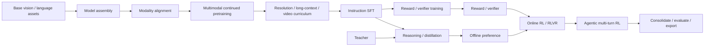

# VLM 完整训练生命周期 v1

- 状态：Accepted
- 日期：2026-08-20
- 目的：定义 TrainOmni 必须能够表达的完整训练阶段，而不是规定每个模型都必须顺序执行全部阶段

## 1. 生命周期不是一条固定脚本

VLM 训练应表示为有类型的 artifact DAG：一个 stage 消费模型、数据、teacher/reference/reward/verifier 等输入，产生带 lineage 的 checkpoint 和评测结果。常见主干如下：



关键含义：

- 这是 DAG，不是写死的 `for stage in [...]`；teacher、reference、reward model 和 verifier 可以来自独立分支。
- alignment、长上下文、reasoning 和 preference 不是所有模型的必选项。
- 同一阶段类型可以执行多次，例如 8K → 32K → 128K curriculum。
- “冻结哪些组件”“使用哪类数据”“执行在哪个 backend”是 stage 参数，不是新的阶段名称。
- export 和 benchmark 虽然不一定做梯度更新，但属于可复现训练生命周期的正式节点。

## 2. StageSpec 的统一结构

每个阶段必须解析为同一套稳定字段：

```yaml
stage:
  id: mm_sft_01
  type: instruction_sft
  inputs:
    model: artifact://mm_cpt_03/best
    teacher: null
    reference: null
    reward: null
  objective:
    id: masked_causal_lm
    config: {}
  component_policy: {}
  data:
    mixture: mm_sft_v4
    curriculum: null
  optimization: {}
  execution:
    engine: torch
    parallelism: fsdp2
  checkpoint: {}
  evaluations: []
  gates: []
  outputs: {}
```

字段职责：

| 字段 | 必须表达的内容 |
|---|---|
| identity | stage ID、类型、schema version、seed、父 lineage |
| inputs | 初始 checkpoint、teacher、reference、reward/verifier 与 processor 版本 |
| objective | 目标函数 ID、loss policy、所需 sample/batch capability |
| component policy | train/freeze、LR、weight decay、dtype、LoRA、activation checkpoint、clip policy |
| data | dataset manifest、mixture、sampling、transform、curriculum、budget 与 bad-sample policy |
| optimization | optimizer、scheduler、global batch/token budget、max steps/tokens |
| execution | engine、precision、topology、parallelism、compile/kernel policy |
| checkpoint | 保存频率、retention、resume level、export policy |
| evaluations | in-loop validation、generation、外部 benchmark 和性能测量 |
| gates | 必须满足的 loss/metric、数据检查、数值检查或人工审批条件 |
| outputs | checkpoint、adapter、processor、manifest、metrics 与 sample trace |

配置编译器在加载大模型前完成 capability negotiation：

```text
stage requirements
  ∩ model plugin capabilities
  ∩ objective capabilities
  ∩ engine capabilities
  ∩ rollout/eval provider capabilities
  ∩ hardware/topology capabilities
```

不满足条件时必须指出冲突项，不能默默降级。

## 3. 完整阶段目录

### S0：视觉基础能力准备（可选）

用途：当 vision encoder 本身不满足任务要求时，执行视觉预训练或视觉继续预训练。

典型目标：

- classification/contrastive/masked image modeling；
- OCR、文档、检测/grounding 专项视觉任务；
- 新分辨率、视频或领域图像适配。

框架要求：

- 允许无 LLM 的 vision-only model bundle；
- 支持 vision-specific objective 和 evaluator；
- 输出能被后续 VLM assembly 引用的版本化组件 artifact。

首版可只保留协议与外部 stage adapter，不需要自研视觉 foundation training recipe。

### S1：模型组装与模态对齐

用途：连接预训练 vision encoder 与 LLM，初始化并训练 projector/connector/resampler/merger，或做轻量跨模态对齐。

常见策略：

- 冻结 vision encoder 与 LLM，只训练 connector；
- 解冻 vision top layers 或 LLM embedding/norm；
- caption、OCR、短描述、region-text alignment；
- masked next-token、contrastive 或 feature regression loss。

框架要求：

- 显式 component catalog 与逐组件优化策略；
- 多 optimizer group 和逐组件梯度/参数统计；
- tokenizer/media special token 变更有 manifest 与初始化记录；
- 支持组合式 VLM，而不要求 checkpoint 原本就是原生 VLM。

### S2：多模态继续预训练 / 统一预训练

用途：让模型在大规模 interleaved、多图、caption、OCR、document、grounding、video/audio 数据上学习通用多模态能力。

框架要求：

- map-style 与 streaming 数据；
- 可复现 mixture、temperature sampling、quality bucket 和动态权重；
- image/multi-image/interleaved 是基础能力，video/audio 按实现里程碑接入；
- text/media 联合 cost estimation、token/pixel/frame budget batching；
- packing、padding-free 与 segment isolation；
- 以 token/media/compute budget 为主要进度单位，不只依赖 epoch。

### S3：分辨率、长上下文与视频课程

用途：逐步提高图像分辨率、视觉 token 数、视频帧数和上下文长度，避免一次性进入最昂贵配置。

它可以是 S2/S4 的 curriculum 子阶段，也可以独立成为 stage。框架必须显式记录：

- processor resize/crop/tile policy；
- max pixels、frames、text tokens、total sequence cost；
- RoPE/position policy 与 context extension；
- CP/SP/Ulysses 等并行计划；
- 每一 curriculum boundary 的 checkpoint 与评测 gate。

### S4：多模态 Instruction SFT

用途：学习对话、指令遵循、OCR/文档、grounding、视频、工具使用与结构化输出。

框架要求：

- multi-turn、assistant-only/completion-only、任意 span/token weight；
- 结构化 JSON、bbox/point、tool call/result；
- chosen response 以外的 system/user/tool 内容默认不参与 loss，但策略可配置；
- 支持 full/freeze/LoRA/QLoRA 和 component-specific PEFT；
- 数据检查能展示 formatter 后文本、token/source span、loss mask 与 media 顺序。

### S5：Reasoning、蒸馏与能力强化

用途：从 teacher 或筛选后的推理轨迹学习长 CoT、领域能力或更强的输出分布。

需要支持的 objective family：

- sequence-level KD / rejection sampling SFT；
- token/logit KL distillation；
- on-policy distillation；
- 多 loss 组合，例如 CE + KL + feature alignment；
- teacher cache/offline logits 与在线 teacher inference。

框架要求将 teacher identity、generation config、采样版本和过滤规则写入 provenance。

### S6：Reward model / Judge / Verifier 准备（可选分支）

用途：训练在线 RL 所需的 learned reward、process reward、judge 或可执行 verifier；规则奖励也在这里登记和测试。

可能是：

- pairwise/listwise reward model；
- outcome/process reward model；
- OCR/grounding/数学/代码的 deterministic verifier；
- 多 reward composer 与 normalization/calibration。

框架要求 reward 输出带版本、输入 schema、range、calibration 和 provenance；不能在 RL recipe 中出现无法追踪的匿名 Python 函数。

### S7：离线偏好优化

用途：使用已收集的 chosen/rejected、评分或无偏好样本进行 DPO/MPO/KTO/ORPO/SimPO 等训练。

框架要求：

- prompt/media 共享或分支引用；
- reference model/adapter identity；
- pair/list/score-level metadata 与 margin；
- loss variant、beta/temperature 和 normalization 进入 resolved config；
- preference sample 在进入 TRL 等算法 adapter 前完成 canonical validation。

### S8：在线 RL / RLVR

用途：通过在线 rollout 和 reward/verifier 更新模型，包括 PPO、GRPO、GSPO、RLOO、REINFORCE++ 等。

框架要求：

- trainer 与 rollout provider 解耦；
- colocated/server/disaggregated rollout；
- actor/reference/reward/version 管理和权重同步；
- sampling config、rollout model version、reward breakdown、tool/environment trace 可审计；
- 支持 rule reward、model judge、execution verifier 和组合奖励；
- backend 明确声明 exact、stage-boundary 或 weights-only 的恢复等级。

此阶段通常由 veRL/AReaL 等 backend 整体执行，TrainOmni 负责 contract、编译、监控与 artifact 收口。

### S9：Agentic / 多轮多模态 RL

用途：模型在多轮环境中调用搜索、代码、GUI、视觉裁剪/缩放等工具，工具结果可能产生新的 image/video/audio。

框架要求：

- environment/agent protocol 与 OpenAI-compatible message/tool schema 映射；
- 每轮 observation/action/tool result 与 media lineage；
- episode termination、timeout、sandbox 和 resource budget；
- per-turn/per-episode reward 与 credit assignment；
- 异步 rollout、staleness/version policy；
- 可回放的完整 episode trace，敏感数据可做脱敏或只存 hash。

### S10：合并、评测与发布

用途：把训练 shard/adapter 合并为可消费 artifact，并执行质量门禁。

框架要求：

- DCP → consolidated/HF checkpoint；
- LoRA merge 或保留 adapter 两种发布方式；
- processor/tokenizer/config/generation config 一起导出；
- lmms-eval/EvalScope/自定义 suite adapter；
- 性能、显存、吞吐和部署 smoke；
- model card、数据/许可摘要、训练 lineage 和已知限制。

任何 stage 都能触发轻量 validation；S10 是正式发布评测，不是唯一评测入口。

## 4. 跨阶段公共抽象

### 4.1 Objective 与 Stage 分离

`instruction_sft` 是阶段意图，`masked_causal_lm` 是目标函数。相同 objective 可用于 alignment、CPT 和 SFT，但：

- component policy 不同；
- data mixture 不同；
- loss mask policy 不同；
- eval gate 不同。

因此 recipe 不应只写 `task: sft`，也不应把所有阶段差异塞进一个 Trainer 参数类。

### 4.2 Component policy

所有 stage 通过稳定 component ID 控制参数，而不是模型参数名前缀：

```text
vision_encoder
vision_merger
connector
language_model
audio_encoder
reward_head
other (默认冻结并要求审计)
```

每个参数必须恰好归属一个 component。策略至少覆盖 trainable、optimizer group、LR、weight decay、precision、grad clip、activation checkpoint 和 PEFT。

### 4.3 Artifact 与 lineage

Stage 输入输出都使用 artifact reference。最少保存：

- artifact ID、父 artifact、stage/run ID；
- model/processor/tokenizer/plugin 版本；
- checkpoint 文件 manifest 与 hash；
- canonical/resolved recipe；
- dataset manifest/fingerprint；
- code/environment/backend version；
- metrics/eval 与恢复等级。

### 4.4 统一恢复等级

| 等级 | 含义 |
|---|---|
| `exact` | 恢复后下一 microbatch、RNG、packer、optimizer step 和模型状态一致 |
| `stage_boundary` | 可从最近完整阶段/同步点继续，但 stage 内样本顺序可能变化 |
| `weights_only` | 仅恢复权重并创建新 lineage，不声称训练连续性 |

默认 torch/FSDP2 engine 的目标是 `exact`；外部 RL backend 至少必须支持并声明 `stage_boundary`。

## 5. 阶段切换门禁

Stage 成功不能只以进程 exit code 判断。建议统一 gate 类型：

- data gate：无悬空 media、坏样本率、token/pixel 分布、license allowlist；
- model gate：组件参数归属、trainable 数量、forward schema、finite output；
- numerical gate：loss/grad finite、短 overfit、resume equivalence；
- quality gate：指定 validation/benchmark 指标；
- artifact gate：checkpoint 完整、hash/manifest、processor 一致、可 reload；
- resource gate：吞吐、OOM 次数、磁盘与 checkpoint 时延；
- manual gate：高成本下阶段或发布前人工确认。

Gate 失败时 checkpoint 仍可保留为 failed-run artifact，但不会成为下游默认输入。

## 6. 新模型为什么只是注册

一个模型插件只回答模型家族特有的问题：

- 如何构建 model/processor；
- canonical content 如何格式化和编码；
- forward kwargs 与 collate 形状；
- 参数如何划分组件；
- 支持哪些 modality/objective/packing/parallelism；
- 如何保存、加载和导出。

阶段图、数据 reader/mixture、objective 定义、engine、checkpoint、eval 和 CLI 不属于模型插件。满足这个边界后，未来目标模型只是 S1/S2/S4 等通用阶段上的一个 `model.plugin` 值，而不是一套新的训练框架。
